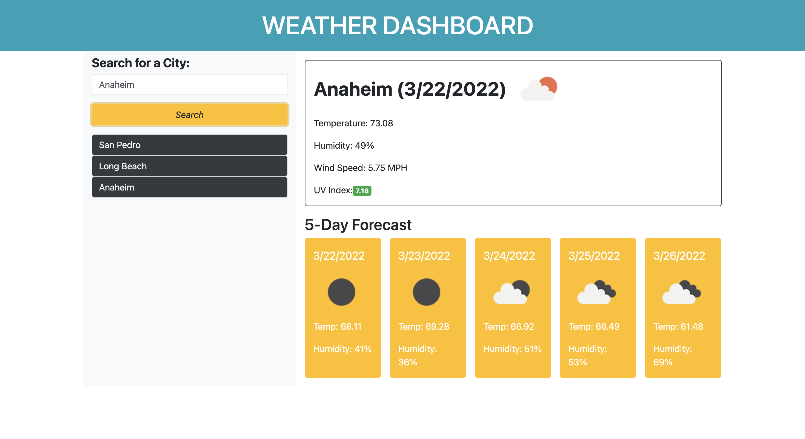

# Weather-Dashboard

<h1 align="center">🌦 5 Day Weather Dashboard 🌦</h1>

 
## Description
Are you constantly forgetting to check the weather before you leave the house in morning?  For the people who don't want to constantly deal with the wrong clothes for the wrong weather, here is a 5 day weather dashboard to check for any plans you may have.  Plan for that hiking trip or plan for a rainy day in or just make sure you have on the right clothes before you leave the house.   
Available at:   https://tayhern.github.io/Weather-Dashboard/

## Table of Contents
- [Description](#description)
- [Installation](#installation)
- [Usage](#usage)
- [License](#license)
- [Contributing](#contributing)
- [Tests](#tests)
- [Questions](#questions)
## Installation
To run the application, head to https://tayhern.github.io/Weather-Dashboard/
## Usage
For those who need to know the weather instantly.
## License

 
This application is covered by the MIT license. 
## Contributing
Taylor Hernandez and Open Weather API.
## Tests
Not right now.
## Questions
Just email Hernandeztaylor1@gmail.com 
 
:octocat: Find me on GitHub: [TayHern](https://github.com/TayHern) 
 
Email me with any questions: hernandeztaylor1@gmail.com  
  